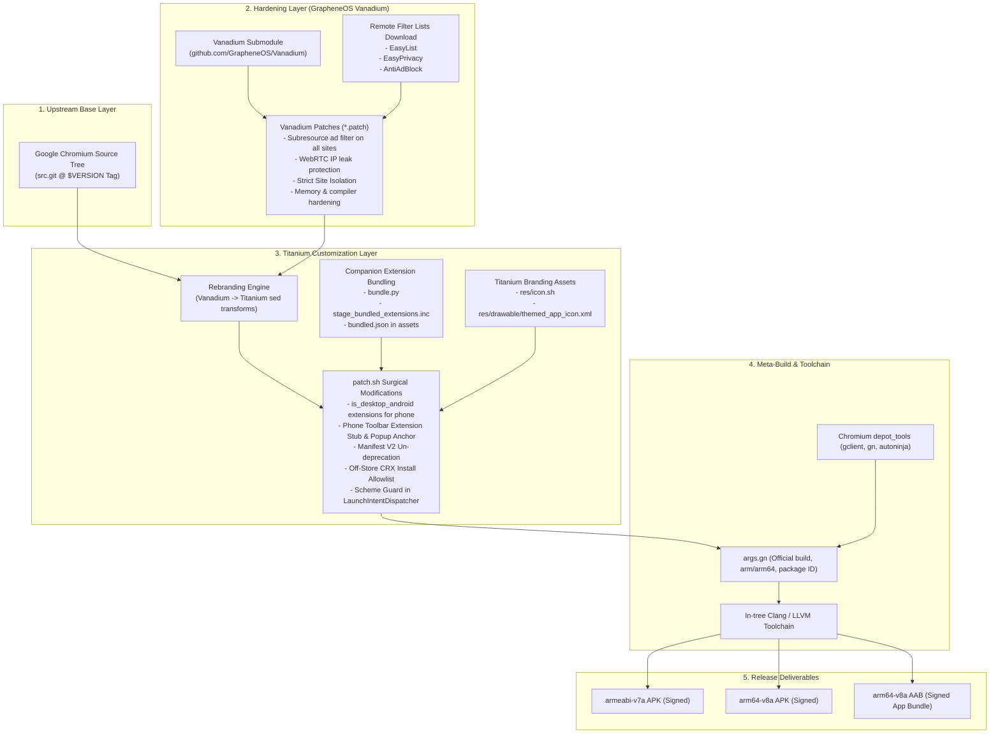
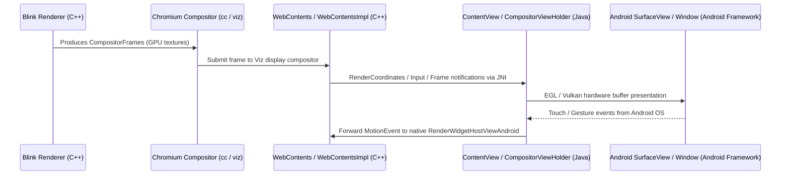

# 02 — Actual System Architecture & Layer Integration

## 1. Architectural Assembly Flow

Titanium Browser is not constructed as a single source codebase. It is an **orchestrated multi-layer stack** assembled dynamically at compile time.



---

## 2. Layer Analysis

### Layer 1: Google Chromium Engine (`src.git`)
- Fetched directly from `https://chromium.googlesource.com/chromium/src.git` at the tag extracted from `vanadium/args.gn` (e.g., `153.0.8010.36`).
- Provides the Blink rendering engine, V8 JavaScript engine, Chromium Network Stack, `content/` embedder layer, and base Android browser application components (`chrome/android/java`).

### Layer 2: GrapheneOS Vanadium Hardening
- Imported as a Git submodule from `https://github.com/GrapheneOS/Vanadium.git`.
- Supplies over 300 surgical patches modifying Chromium internals:
  - **Subresource Filter**: Expands Google's Better Ads Standards filter into a system-wide adblock engine driven by EasyList and EasyPrivacy (`0042`, `0194-0196`, `0198-0199`).
  - **Local Credentials**: Restores local SQLite login database (`0264-0269`) removing Google Play Services account dependencies.
  - **Network Privacy**: Blocks `X-Client-Data` variations headers, strips telemetry, and enforces WebRTC privacy (`DisableNonProxiedUdp`).
  - **Compiler Hardening**: Adds Clang flags for shadow call stack, stack clash protection, and zero-initialization of auto variables.

### Layer 3: Titanium Customization & Extension Enabler
- Applied via `build.sh` and `patch.sh`:
  - Prunes Vanadium patches that conflict with standalone phone builds (e.g. Trichrome targets, language settings, and predictive back).
  - Performs global token substitution (`VANADIUM` -> `TITANIUM`).
  - Adapts Chromium’s desktop Android extension runtime (`is_desktop_android = true`) for phone screens.
  - Injects extension toolbar icons into phone layout XML (`toolbar_phone.xml`).
  - Adjusts extension popups from desktop anchored dropdowns to full-screen/modal views on mobile (`extension_action_popup_contents.cc`, `ExtensionActionPopup.java`).
  - Re-enables Manifest V2 extension support (`webstore_private_api.cc`, `manifest_v2_handler.cc`).
  - Injects bundled extensions via native APK asset reading (`extensions/stage_bundled_extensions.inc`).

---

## 3. Communication Between Native (C++) and Android (Java)

Chromium does not use standard Android NDK `System.loadLibrary` with manual `FindClass`/`GetMethodID` lookups in production. Instead, it utilizes Google's **automated JNI generation pipeline**:

```
                 Java Interface / Class
              (@JNINamespace, @NativeMethods)
                          │
                          ▼
            Chromium JNI Generator (Python)
                          │
                          ▼
         Generated JNI Headers (*_jni.h)
                          │
       ┌──────────────────┴──────────────────┐
       ▼                                     ▼
Native C++ Implementation             Java Native Calls
(JNI_ClassName_MethodName)       (ClassNameJni.get().method())
```

### 1. Java-to-C++ Calls
1. A Java class declares an `@NativeMethods` interface:
   ```java
   @JNINamespace("chrome::android")
   public class DevToolsWindowAndroid {
       interface Natives {
           boolean isDevToolsAllowed(Profile profile, WebContents webContents);
       }
   }
   ```
2. The Chromium build tool `generate_jni` produces a C++ header file (`DevToolsWindowAndroid_jni.h`).
3. C++ implements the native function:
   ```cpp
   static jboolean JNI_DevToolsWindowAndroid_IsDevToolsAllowed(
       JNIEnv* env, const JavaParamRef<jobject>& j_profile, ...);
   ```
4. Java code calls the stub: `DevToolsWindowAndroidJni.get().isDevToolsAllowed(profile, webContents)`.

### 2. C++-to-Java Calls
1. JNI generation scans Java classes for `@CalledByNative` annotations:
   ```java
   @CalledByNative
   public void onLoaded() { ... }
   ```
2. C++ invokes generated helper functions:
   ```cpp
   Java_ExtensionActionPopupContents_resizeDueToAutoResize(
       AttachCurrentThread(), java_object_, width, height);
   ```
   *(Observed directly in Titanium's `patch.sh` line 99).*

---

## 4. How Web Content Reaches the Android UI

Chromium bridges native rendering to Android views via the **Compositor and WebContents architecture**:



1. **`WebContents`**: The central Chromium entity representing an active webpage or tab.
2. **`RenderWidgetHostViewAndroid`**: The C++ native view implementing Android-specific rendering coordination.
3. **`CompositorViewHolder` / `ContentView`**: The top-level Android `ViewGroup` containing the rendered page, overlays, and drag-drop handlers.
4. **Android `SurfaceView`**: High-performance surface that receives direct hardware-accelerated GPU composition frames from the native `viz` service.
