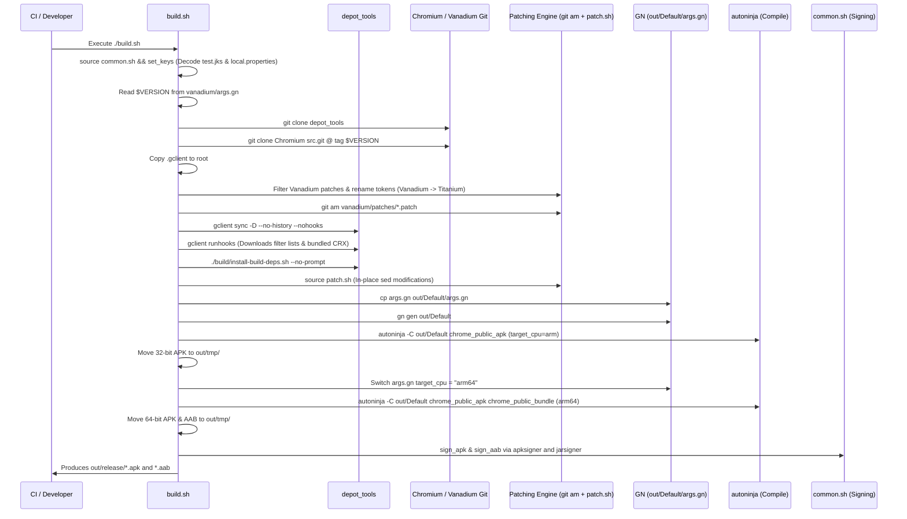

# 03 — Build System & Compilation Pipeline Deep Dive

## 1. Overview of Meta-Build Tools

The Chromium build system differs radically from conventional Android projects:
- **No Gradle for compilation**: While Chromium can generate Gradle files for Android Studio syntax inspection via `tools/android/generate_gradle.py`, the actual production compilation is driven by **GN (Generate Ninja)**, **Google Clang/LLVM**, and **Ninja / Siso**.
- **`gclient`**: Google's multi-repository checkout and synchronization tool, configured via `.gclient`.
- **`depot_tools`**: A package of utilities containing `gclient`, `gn`, `ninja`, `autoninja`, and Python tool wrappers.
- **GN**: A meta-build system that consumes `BUILD.gn` and `.gni` files to generate build files for Ninja.
- **Ninja / Siso**: Low-level, extremely fast parallel build executors.
- **In-tree Android SDK & NDK**: Chromium does not require a locally pre-installed Android SDK/NDK; it downloads a pinned hermetic copy into `third_party/android_sdk` and `third_party/android_toolchain` via gclient hooks.

---

## 2. End-to-End Build Sequence



---

## 3. Step-by-Step Command Breakdown

### Step 1: Toolchain Preparation
```bash
sudo apt-get update
sudo apt-get install -y sudo lsb-release file nano git curl python3 python3-pillow imagemagick librsvg2-bin
sudo dpkg --add-architecture i386
sudo apt-get update && sudo apt-get install -y libgcc-s1:i386
git clone --depth 1 https://chromium.googlesource.com/chromium/tools/depot_tools.git
export PATH="$PWD/depot_tools:$PATH"
```

### Step 2: Source Fetching
- Chromium version tag is extracted directly from `vanadium/args.gn`:
  ```bash
  export VERSION=$(grep -m1 -o '[0-9]\+\(\.[0-9]\+\)\{3\}' vanadium/args.gn)
  # Example: 153.0.8010.36
  ```
- A shallow fetch downloads only the exact tag into `chromium/src`:
  ```bash
  mkdir -p chromium/src/out/Default; cd chromium/src
  git init
  git remote add origin https://chromium.googlesource.com/chromium/src.git
  git fetch --depth 1 https://chromium.googlesource.com/chromium/src.git +refs/tags/$VERSION:chromium_$VERSION
  git checkout $VERSION
  ```

### Step 3: Vanadium Patch Application
Titanium removes specific Vanadium patches before applying the rest:
- `*trichrome-{apk-build-targets,browser-apk-targets}.patch`: Removes Trichrome shared library targets because Titanium builds monolithic `chrome_public_apk`.
- `*{detailed,supported}-language*.patch`: Removes language settings overrides.
- `*javascript-optimizer-{site-setting,settings-UI}.patch`: Removes JIT site-settings UI that conflicts with extension runtime.
- `*component-updates.patch`: Removes GrapheneOS component updater.
- `*{pdf,PDF,for-content-public,toolbar-button,configs-from-config-app,new-tab-card,predictive-back*}*.patch`: Removes Vanadium custom new-tab card, config app, and predictive back patches.
- **Rebranding**:
  ```bash
  replace "$SCRIPT_DIR/vanadium/patches" "VANADIUM" "TITANIUM"
  replace "$SCRIPT_DIR/vanadium/patches" "Vanadium" "Titanium"
  replace "$SCRIPT_DIR/vanadium/patches" "vanadium" "titanium"
  git am --whitespace=nowarn --keep-non-patch $SCRIPT_DIR/vanadium/patches/*.patch
  ```

### Step 4: Gclient Hooks & Dependency Sync
```bash
gclient sync -D --no-history --nohooks
gclient runhooks
```
The hooks defined in [`.gclient`](file:///v:/android-Zyro-browser-main/android-zyro-browser-main/.gclient) execute automatically:
1. `fetch_filter_lists`: Downloads AntiAdBlock, EasyList, and EasyPrivacy text lists into `src/titanium/android_config/filter_lists/filter_lists_easylist.txt`.
2. `apply_subprojects_patches`: Applies Vanadium patches for Chromium third-party subprojects.
3. `fetch_titanium_extension`: Executes `extensions/bundle.py`, downloading the latest `titanium.crx` from GitHub releases and placing it in `extensions/dist`.

### Step 5: Titanium Patch Injection (`patch.sh`)
- Executed in the `chromium/src` directory:
  - Generates adaptive icons using ImageMagick and SVG templates.
  - Adds `android:extractNativeLibs="false"` and PDF intent filter to `AndroidManifest.xml`.
  - Injects `extension_assets` target into `chrome/android/BUILD.gn`.
  - Injects `stage_bundled_extensions.inc` into `chrome/browser/extensions/external_pref_loader.cc`.
  - Injects extension toolbar container into `toolbar_phone.xml` and enables rendering in `ToolbarPhone.java`.
  - Un-deprecates Manifest V2 in `webstore_private_api.cc` and `manifest_v2_handler.cc`.
  - Adds off-store extension install permissions for Edge, Opera, and local extension schemes in `download_crx_util.cc`.
  - Hardens `LaunchIntentDispatcherHooks.java` to prevent intent exploitation.

### Step 6: GN Configuration (`args.gn`)
Key build configuration flags defined in [`args.gn`](file:///v:/android-Zyro-browser-main/android-zyro-browser-main/args.gn):

| GN Argument | Value | Architectural Purpose |
| :--- | :--- | :--- |
| `chrome_public_manifest_package` | `"io.github.jqssun.helium"` | Defines the Android Application ID / package name in AndroidManifest. |
| `is_desktop_android` | `true` | **Crucial flag**: Enables Chromium's desktop extension framework and desktop features on Android. |
| `target_os` | `"android"` | Configures Android compilation. |
| `target_cpu` | `"arm"` / `"arm64"` | Target architecture (armeabi-v7a or arm64-v8a). |
| `is_official_build` | `true` | Enables high optimization, LTO, dead code elimination, and security checks. |
| `is_debug` | `false` | Disables debug symbols and verbose assertions. |
| `symbol_level` | `1` | Retains line number tables for stack traces while keeping binary size manageable. |
| `use_siso` | `true` | Utilizes Chromium's next-generation build compiler (Siso). |
| `use_login_database_as_backend` | `true` | Uses local SQLite database for passwords instead of Google Play Services Credential Manager. |
| `google_api_key` | `"x"` | Neutralizes Google proprietary API integrations (Sync, Location, Speech). |
| `v8_enable_drumbrake` | `true` | Enables V8 JIT-less WebAssembly interpreter for hardened execution. |
| `proprietary_codecs` | `true` | Enables MP4, H.264, AAC multimedia playback. |
| `ffmpeg_branding` | `"Chrome"` | Enables proprietary codecs in FFmpeg. |

### Step 7: Compilation Targets
```bash
# 32-bit ARM APK
autoninja -C out/Default chrome_public_apk

# 64-bit ARM APK & AAB Bundle
sed -i 's/target_cpu = "arm"/target_cpu = "arm64"/' out/Default/args.gn
autoninja -C out/Default chrome_public_apk chrome_public_bundle
```

### Step 8: Code Signing
Defined in [`common.sh`](file:///v:/android-Zyro-browser-main/android-zyro-browser-main/common.sh):
- APK signing: Uses Android SDK `apksigner` with V2/V3/V4 signature schemes:
  ```bash
  $apksigner sign -verbose -ks keys/test.jks --ks-pass pass:$storePassword \
      --key-pass pass:$keyPassword --ks-key-alias $keyAlias --out $OUT $IN
  ```
- AAB signing: Uses JDK `jarsigner`:
  ```bash
  jarsigner -verbose -sigalg SHA256withRSA -digestalg SHA-256 \
      -keystore keys/test.jks -storepass $storePassword -keypass $keyPassword \
      -signedjar $OUT $IN $keyAlias
  ```
