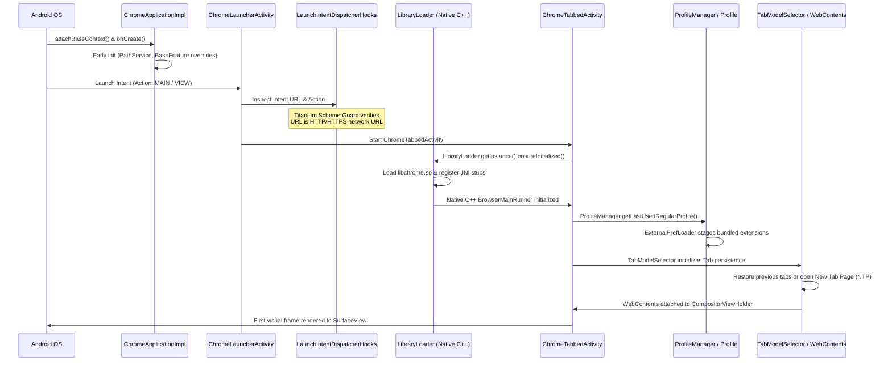

# 04 — Android Application Entry Points & Startup Lifecycle

## 1. Application Manifest & Manifest Overrides

The Android manifest is located at `chrome/android/java/AndroidManifest.xml` within the Chromium checkout. At build time, GN merges library manifests and replaces variables (such as package name `${PACKAGE}`).

### Titanium Manifest Modifications
In [`patch.sh`](file:///v:/android-Zyro-browser-main/android-zyro-browser-main/patch.sh), two direct edits are made to the base manifest:
1. **Extraction of Native Libraries**:
   ```bash
   sed -i 's|<application |<application android:extractNativeLibs="false" |' chrome/android/java/AndroidManifest.xml
   ```
   Ensures `libchrome.so` is memory-mapped directly from the APK/AAB without uncompressing to disk, reducing disk footprint and installation time.
2. **Direct PDF MIME-Type Handling**:
   ```bash
   sed -i 's|<data android:mimeType="message/rfc822"/>|<data android:mimeType="message/rfc822"/><data android:mimeType="application/pdf"/>|' chrome/android/java/AndroidManifest.xml
   ```
   Registers the browser as an Android system handler for opening local and streamed PDF files.

---

## 2. Master Entry Point Mapping

| Component | Fully Qualified Class Name | Source Path (Chromium) | Role |
| :--- | :--- | :--- | :--- |
| **Application** | `org.chromium.chrome.browser.ChromeApplication` | `chrome/android/java/src/org/chromium/chrome/browser/ChromeApplication.java` | Main OS process initialization; delegates to `ChromeApplicationImpl`. |
| **Application Impl** | `org.chromium.chrome.browser.ChromeApplicationImpl` | `chrome/android/java/src/org/chromium/chrome/browser/ChromeApplicationImpl.java` | Initializes memory tracking, early crash handling, base context attachment hooks. |
| **Launcher Router** | `org.chromium.chrome.browser.ChromeLauncherActivity` | `chrome/android/java/src/org/chromium/chrome/browser/ChromeLauncherActivity.java` | Alias/trampoline activity receiving launcher intents and routing to tabbed or custom tab modes. |
| **Dispatcher** | `org.chromium.chrome.browser.LaunchIntentDispatcher` | `chrome/android/java/src/org/chromium/chrome/browser/LaunchIntentDispatcher.java` | Analyzes incoming intents, verifies URLs, selects activity, applies security guards. |
| **Dispatcher Hooks** | `org.chromium.chrome.browser.LaunchIntentDispatcherHooks` | `titanium/chromium_src/.../LaunchIntentDispatcherHooks.java` | **Modified by Titanium**: Enforces strict URL scheme validation (`URLUtil.isNetworkUrl`). |
| **Primary Browser Activity** | `org.chromium.chrome.browser.ChromeTabbedActivity` | `chrome/android/java/src/org/chromium/chrome/browser/ChromeTabbedActivity.java` | Main multi-tab browser activity managing tab switcher, omnibox, and toolbar. |
| **Custom Tab Activity** | `org.chromium.chrome.browser.customtabs.CustomTabActivity` | `chrome/android/java/src/org/chromium/chrome/browser/customtabs/CustomTabActivity.java` | In-app browser window for external applications (Android Custom Tabs / CCT). |

---

## 3. End-to-End Application Startup Flow



---

## 4. Detailed Startup Steps

### Phase A: Application Initialization
1. **`ChromeApplication.attachBaseContext(Context)`**: Invoked by Android OS. Vanadium hook `0218-Add-a-method-to-hook-at-Application.attachBaseContex.patch` executes early environment setup.
2. **`ChromeApplicationImpl.onCreate()`**: Initializes process-wide singletons, sets up ThreadUtils, installs base crash handlers, and registers font preloading.

### Phase B: Intent Routing & Security Validation
1. **`ChromeLauncherActivity`** receives the intent.
2. It delegates intent analysis to **`LaunchIntentDispatcher`**.
3. **Titanium Scheme Guard Check**:
   In upstream Chromium, non-network URLs (`javascript:`, `file:`, `content:`, `intent:`) might be forwarded under certain flags.
   Titanium patches [`LaunchIntentDispatcherHooks.java`](file:///v:/android-Zyro-browser-main/android-zyro-browser-main/patch.sh#L22-L24):
   ```java
   if (!Intent.ACTION_VIEW.equals(intent.getAction()) ||
       !android.webkit.URLUtil.isNetworkUrl(IntentHandler.getUrlFromIntent(intent))) {
       // Rejects non-HTTP/HTTPS schemes
   }
   ```
   This prevents arbitrary custom scheme invocation and intent redirection vulnerabilities.

### Phase C: Native Engine Initialization
1. **`LibraryLoader.ensureInitialized()`**: Dynamically loads `libchrome.so`.
2. Native entry point `JNI_OnLoad` executes:
   - Registers JNI methods for core modules.
   - Invokes `content::ContentMain()` -> `ChromeMain()`.
   - Starts Chromium browser threads: UI thread, IO thread, ThreadPool workers.

### Phase D: Profile & Extension Initialization
1. **`ProfileManager.getLastUsedRegularProfile()`**: Loads user profile from `/data/data/io.github.jqssun.helium/app_chrome/Default/`.
2. **`ExternalPrefLoader`**:
   - Executes Titanium's injected `StageBundledExtensions` from `extensions/stage_bundled_extensions.inc`.
   - Reads `assets/extensions/bundled.json` from the APK.
   - Extracts `titanium.crx` into the profile directory.
   - Registers the extension into Chromium's extension registry.

### Phase E: Tab Restoration & First Paint
1. **`TabModelSelector`** deserializes `tab_state` from disk.
2. If previous session tabs exist, active tab is loaded; otherwise, a New Tab Page (NTP) is created.
3. In [`ChromeTabbedActivity.java`](file:///v:/android-Zyro-browser-main/android-zyro-browser-main/patch.sh#L128-L132), Titanium checks `UrlOverrideUtils.isNtpOverrideEnabled()`; if an extension overrides the NTP, the extension URL is loaded instead of the native NTP.
4. Active `WebContents` is bound to `CompositorViewHolder` and rendered to the hardware-accelerated Android `SurfaceView`.
