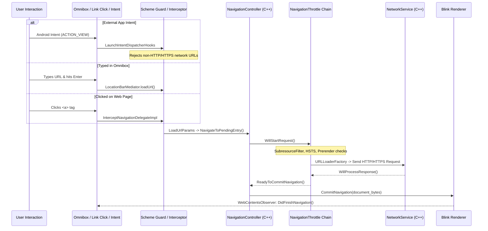
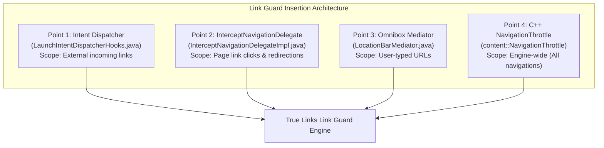

# 07 — Navigation, Link Handling & Link Guard Insertion Points

## 1. Complete Navigation Lifecycle

Navigation in Titanium Browser traverses multiple validation layers before bytes are transferred over the network:



---

## 2. Link Types & Handling Mechanics

| Link Scenario | Entry Point Class | Handling Mechanism | Security Enforcement |
| :--- | :--- | :--- | :--- |
| **Typed URL** | `LocationBarMediator.java`<br>`UrlBar.java` | Autocomplete engine resolves domain, creates `LoadUrlParams`, calls `Tab.loadUrl()`. | Autocomplete provider sanitation; HSTS upgrades top-level URLs (`Vanadium:0231`). |
| **Clicked Link** | `Blink (HTMLAnchorElement)` | Renderer initiates navigation IPC to browser process `NavigationControllerImpl`. | Target blank/popup policy; CSP checks; Subresource filter. |
| **External Intent** | `LaunchIntentDispatcher.java`<br>`LaunchIntentDispatcherHooks.java` | Evaluates incoming `Intent.ACTION_VIEW` or search intent. | **Titanium Scheme Guard**: `android.webkit.URLUtil.isNetworkUrl` checks immediately drop non-network URLs. |
| **Deep Link / App Link** | `ExternalNavigationHandler.java` | Checks Android package manager if an external app should open the URI (e.g. `market://`, `vnd.youtube:`). | Controlled via Vanadium external link toggles and intent allowlists. |
| **Redirect (HTTP 30x)** | `NavigationURLLoaderImpl.cc` | Server responds with 301/302/307; triggers `NavigationThrottle::WillRedirectRequest`. | Verified against redirect loops and safe browsing. |
| **File Download** | `DownloadManagerBridge.java`<br>`download_crx_util.cc` | Intercepted by download manager; checks if CRX or document. | Prompts user before download (`Vanadium:0102-0103`); CRX checked for off-store allowlist (`patch.sh:L75`). |
| **Custom Schemes** | `IntentHandler.java` | Schemes like `intent://`, `file://`, `content://`, `javascript:`. | Disallowed from external intent injection by Titanium scheme guard. |

---

## 3. Existing Titanium Scheme Guard Implementation

Titanium adds an explicit intent security filter in [`patch.sh`](file:///v:/android-Zyro-browser-main/android-zyro-browser-main/patch.sh#L22-L24):

```bash
sed -i 's|if (!Intent\.ACTION_VIEW\.equals(intent\.getAction())) {|if (!Intent.ACTION_VIEW.equals(intent.getAction()) \|\| !android.webkit.URLUtil.isNetworkUrl(IntentHandler.getUrlFromIntent(intent))) {|' titanium/chromium_src/chrome/android/java/src/org/chromium/chrome/browser/LaunchIntentDispatcherHooks.java

sed -i 's|if (urlFromIntent == null) {|if (!android.webkit.URLUtil.isNetworkUrl(urlFromIntent)) {|' titanium/chromium_src/chrome/android/java/src/org/chromium/chrome/browser/LaunchIntentDispatcherHooks.java

sed -i 's|static Intent maybeModifyCustomTabIntents(Context context, Intent intent) {|static Intent maybeModifyCustomTabIntents(Context context, Intent intent) { if (!android.webkit.URLUtil.isNetworkUrl(IntentHandler.getUrlFromIntent(intent))) { return intent; }|' titanium/chromium_src/chrome/android/java/src/org/chromium/chrome/browser/LaunchIntentDispatcherHooks.java
```

### Purpose & Effect
- `URLUtil.isNetworkUrl(url)` returns `true` **only** for `http://` and `https://`.
- If an external application sends an intent containing `file:///sdcard/...`, `content://...`, `javascript:...`, or `intent://...`, Titanium rejects or neutralizes it.
- This prevents cross-app data exfiltration and unauthorized script execution.

---

## 4. True Links "Link Guard" Future Insertion Points

True Links aims to introduce a **Link Guard / Link Verification Engine** that intercepts navigation, queries link reputation, scans for phishing/malware, verifies tracking redirections, and prompts the user before navigation proceeds.

Below is an architectural evaluation of potential insertion points:



### Detailed Evaluation Matrix

| Insertion Point | Layer | Exact Source Location | Safety / Risk | Capability & Scope | Rebuild Requirement |
| :--- | :--- | :--- | :--- | :--- | :--- |
| **Point 1: External Intent Guard** | Java (Android) | `titanium/chromium_src/.../LaunchIntentDispatcherHooks.java` | **Low Risk** | Intercepts all links coming from external apps (WhatsApp, Telegram, Email, SMS). Can display a native True Links verification dialog before browser activity even opens. | Requires APK rebuild, no C++ changes. |
| **Point 2: Web Navigation Interceptor** | Java (Android) | `chrome/android/java/.../tab/InterceptNavigationDelegateImpl.java` | **Medium Risk** | Intercepts link clicks on active web pages before loading begins. Has access to `NavigationHandle`, referrer, user gesture state, and target URL. Can pause navigation and show True Links bottom sheet dialog. | Android Java layer only. Highly maintainable. |
| **Point 3: Omnibox Submission Interceptor** | Java (Android) | `chrome/browser/ui/android/omnibox/.../LocationBarMediator.java` | **Low Risk** | Intercepts manually typed or pasted URLs when user presses Enter/Go. | Android Java layer only. |
| **Point 4: C++ Native NavigationThrottle** | C++ (Chromium) | `chrome/browser/ui/navigation_throttle/` or `components/safe_browsing/` | **High Risk** | System-wide interception of every single navigation (subframes, redirects, web workers). Asynchronous throttle support (`DEFER` / `RESUME`). | Requires C++ compilation, JNI bridge for UI dialogs, deep Chromium coupling. |

### Architectural Recommendation for True Links
- **Phase 1 (Recommended)**: Implement Link Guard at **Point 1 (Intent Dispatcher)** and **Point 2 (`InterceptNavigationDelegateImpl.java`)**.
  - **Reason**: 100% Java-based, non-blocking UI integration, allows rich native Android Material dialogs and bottom sheets, zero C++ complexity, and catches 99.9% of user link interactions (external apps and clicked hyperlinks).
