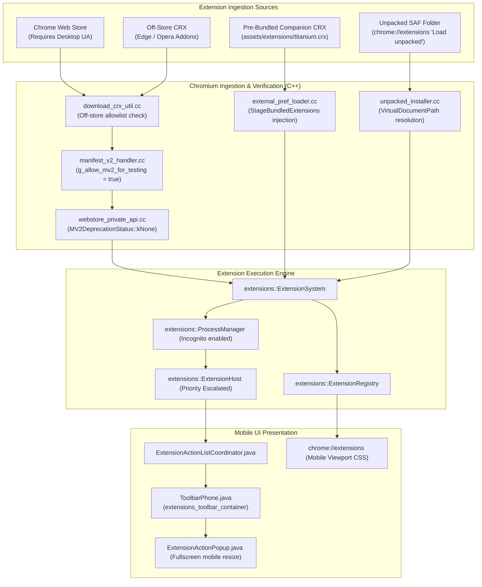

# 08 — Extension Subsystem & Mobile Adaptation Architecture

## 1. Extension Framework Overview

Titanium Browser is one of the very few modern Chromium browsers supporting full **Manifest V2 (MV2)** and **Manifest V3 (MV3)** extensions on Android smartphones.



---

## 2. Manifest V2 & Manifest V3 Support

While Google has actively deprecated and disabled Manifest V2 across desktop Chromium, Titanium **restores full MV2 compatibility** through targeted C++ patches in [`patch.sh`](file:///v:/android-Zyro-browser-main/android-zyro-browser-main/patch.sh#L69-L73):

1. **API Sources Re-inclusion**:
   ```bash
   sed -i 's|uncompiled_sources_ = \[|&\n  "browser_action.json",\n  "page_action.json",|' chrome/common/extensions/api/api_sources.gni
   ```
   Re-includes the legacy MV2 `browserAction` and `pageAction` API schemas into compilation.
2. **Deprecation Status Reset**:
   ```bash
   sed -i 's/api::webstore_private::MV2DeprecationStatus::kHardDisable)));/api::webstore_private::MV2DeprecationStatus::kNone)));/' extensions/browser/api/webstore_private/webstore_private_api.cc
   ```
   Prevents the Webstore API from blocking MV2 installations.
3. **Global MV2 Verification Bypass**:
   ```bash
   sed -i 's/bool g_allow_mv2_for_testing = false;/bool g_allow_mv2_for_testing = true;/' extensions/browser/manifest_v2_handler.cc
   ```
   Instructs the manifest validator to accept `manifest_version: 2` extension packages without error.

---

## 3. Extension Ingestion Pathways

### Pathway A: Pre-Bundled APK Extensions (Zero-Click)
Titanium ships with its companion extension embedded inside the APK:
1. **Build Time**: `.gclient` triggers `extensions/bundle.py`:
   - Downloads `titanium.crx` from GitHub releases.
   - Extracts extension ID from CRX3 public key header.
   - Reads `manifest.json` version.
   - Generates `extensions/dist/bundled.json`.
   - Modifies `extensions/BUILD.gn` to package `bundled.json` and `titanium.crx` into APK assets (`assets/extensions/`).
2. **Runtime Loading**: `patch.sh` injects [`stage_bundled_extensions.inc`](file:///v:/android-Zyro-browser-main/android-zyro-browser-main/extensions/stage_bundled_extensions.inc) into `chrome/browser/extensions/external_pref_loader.cc`:
   - `StageBundledExtensions` opens `assets/extensions/bundled.json` via Android `OpenApkAsset`.
   - If the extension file does not exist on disk or size differs, it writes `titanium.crx` to disk at `DIR_USER_DATA/extensions/`.
   - Merges entries into external extension preferences dictionary.
   - Chromium automatically installs/updates the extension on browser startup without user interaction.

### Pathway B: Off-Store CRX Installation
Upstream Chromium rejects CRX files downloaded outside the Chrome Web Store.
Titanium patches `chrome/browser/download/download_crx_util.cc` ([`patch.sh:L75`](file:///v:/android-Zyro-browser-main/android-zyro-browser-main/patch.sh#L75)):
```cpp
if (const auto& o = item.GetRequestInitiator(); o && o->scheme() == "chrome-extension") return true;
for (const char* d : {"addons.opera.com", "operacdn.com", "microsoftedge.microsoft.com", "edge.microsoft.com", "delivery.mp.microsoft.com"})
    if (item.GetURL().DomainIs(d) || item.GetReferrerUrl().DomainIs(d)) return true;
```
Enables direct extension installations from Opera Add-ons and Microsoft Edge Add-ons.

### Pathway C: Unpacked Developer Extensions (SAF)
On mobile Android, direct filesystem path access is blocked by scoped storage.
Titanium patches `base/android/java/src/org/chromium/base/VirtualDocumentPath.java` ([`patch.sh:L144`](file:///v:/android-Zyro-browser-main/android-zyro-browser-main/patch.sh#L144)) and `extensions/browser/unpacked_installer.cc` ([`patch.sh:L124`](file:///v:/android-Zyro-browser-main/android-zyro-browser-main/patch.sh#L124)):
- Maps Android `DocumentsContract` tree URIs (`com.android.externalstorage.documents`) to virtual document paths.
- Bypasses locale validation crashes for virtual paths in `unpacked_installer.cc`.
- Allows users to select a folder from their internal storage or SD card via the Android system file picker in `chrome://extensions`.

---

## 4. Extension Lifecycle & Runtime Behavior

### Incognito (Off-the-Record) Execution
- In upstream Chromium, extensions are strictly isolated from Incognito profiles unless explicitly permitted.
- Titanium modifies `extensions/browser/process_manager.cc` ([`patch.sh:L107`](file:///v:/android-Zyro-browser-main/android-zyro-browser-main/patch.sh#L107)):
  ```cpp
  // Replaces: if (!context->IsOffTheRecord())
  if (true)
  ```
- Modifies `IncognitoUtils.java` ([`patch.sh:L108`](file:///v:/android-Zyro-browser-main/android-zyro-browser-main/patch.sh#L108)) ensuring extension windows can operate in Incognito.

### Process Priority Escalation
Android's Low Memory Killer (LMK) aggressively terminates background processes.
In [`extensions/browser/extension_host.cc`](file:///v:/android-Zyro-browser-main/android-zyro-browser-main/patch.sh#L111):
```cpp
host_contents_->SetPrimaryPageImportance(
    content::ChildProcessImportance::IMPORTANT,
    content::ChildProcessImportance::NORMAL);
```
Informs the Android kernel that the extension host process carries elevated importance, preventing sudden extension terminations.

---

## 5. Titanium Browser vs. Titanium Companion Extension

| Responsibility | Titanium Browser (This Repo) | Titanium Companion Extension (`android-titanium-extension`) |
| :--- | :--- | :--- |
| **Execution Environment** | Native Android / C++ / Chromium Core | WebExtension JavaScript / HTML / CSS |
| **Extension Framework** | Ingestion, MV2 un-deprecation, toolbar rendering, SAF loaders | User-facing utility features |
| **Features Provided** | Browser engine, tabs, network security, ad-blocking engine | Alternative store User-Agent overrides, external download manager routing, dark mode toggle scripts |
| **Update Mechanism** | Full APK update via GitHub / Play Store | CRX update or bundled update via `bundle.py` |
