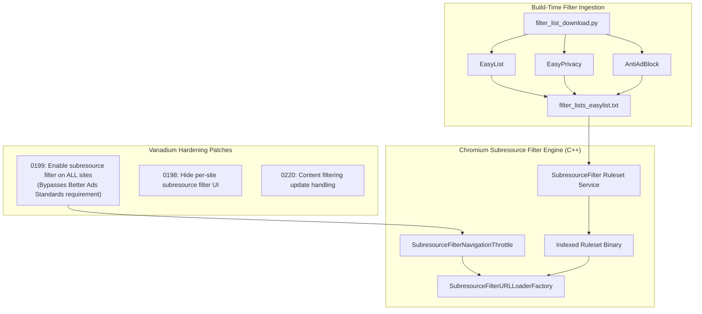

# 09 — Privacy, Security & Content Blocking Engine

## 1. Engine Classification & Reality Check

> [!IMPORTANT]
> **Titanium Browser's ad blocking is NOT Brave Shields / adblock-rs.**
> Titanium Browser does not use Brave's custom Rust-based filtering engine, nor does it use a full uBlock Origin cosmetic injection pipeline by default. Instead, it leverages **Chromium's native `subresource_filter` engine**, radically hardened by **GrapheneOS Vanadium** to filter advertisements and trackers across all websites.

---

## 2. Content Blocking Architecture



### 1. The Filter List Pipeline
- **Hook Trigger**: [`.gclient`](file:///v:/android-Zyro-browser-main/android-zyro-browser-main/.gclient) declares the `fetch_filter_lists` hook:
  ```python
  python3 ../vanadium/tools/filter_lists/filter_list_download.py \
    --output src/titanium/android_config/filter_lists/filter_lists_easylist.txt \
    --urls \
      https://easylist-downloads.adblockplus.org/antiadblockfilters.txt \
      https://easylist.to/easylist/easylist.txt \
      https://easylist.to/easylist/easyprivacy.txt
  ```
- **Ruleset Indexing**: Chromium’s native ruleset indexer compiles these raw text ABP-format rules into an in-memory indexed Trie structure (`IndexedRuleset`).

### 2. Universal Activation (`0199-enable-subresource-filter-on-all-sites.patch`)
In upstream Google Chromium, the subresource filter is dormant on normal websites and is only triggered if Google's Safe Browsing API flags a site for violating the "Better Ads Standards".
Vanadium overrides the activation evaluation:
- Subresource filtering is **forced active on 100% of websites**.
- Every network request initiated by web pages (scripts, iframes, images, fetches) is matched against the indexed EasyList/EasyPrivacy rules before the network connection is made.

### 3. Network Blocking vs. Cosmetic Filtering
- **Network Level**: The `subresource_filter` blocks subresource network requests natively in C++ before headers are sent.
- **Cosmetic Filtering (Element Hiding)**: Native Chromium `subresource_filter` has limited support for complex CSS element hiding (`##.ad-banner`). For advanced cosmetic hiding, users can install uBlock Origin or the Titanium Companion Extension.

---

## 3. Comprehensive Privacy Hardening Matrix

| Privacy Feature | Implementation Layer | Source / Patch Origin | Mechanism |
| :--- | :--- | :--- | :--- |
| **WebRTC IP Leak Shield** | C++ & Java Preference | `Vanadium:0100`<br>`Vanadium:0164` | Defaults WebRTC IP handling policy to `DisableNonProxiedUdp` (shields local and private IP addresses). Adds a user-configurable toggle under Settings -> Privacy and Security. |
| **Third-Party Cookies Blocked** | C++ Preferences | `Vanadium:0077` | Modifies default preference in `CookieSettings` to block third-party cookies globally out of the box. |
| **Variations Header Stripping** | C++ Network | `Vanadium:0106` | Disables the `X-Client-Data` HTTP request header, preventing Google servers from fingerprinting browser build experiments. |
| **Strict Site Isolation** | C++ Content Engine | `Vanadium:0123` | Forces cross-site documents and iframes into dedicated sandboxed OS renderer processes on Android. |
| **Search Engine Privacy** | C++ Configuration | `Vanadium:0114` | Replaces Google with **DuckDuckGo** as the default search provider. Removes search provider logos (`Vanadium:0089`). |
| **No Google Sync / Account** | C++ GN Configuration | [`args.gn:L18-20`](file:///v:/android-Zyro-browser-main/android-zyro-browser-main/args.gn#L18-L20) | Neutralizes Google API keys (`google_api_key = "x"`), disabling account sync and telemetry. |
| **Local Password Database** | C++ SQLite Backend | `Vanadium:0264-0269`<br>[`args.gn:L23`](file:///v:/android-Zyro-browser-main/android-zyro-browser-main/args.gn#L23) | Re-enables `use_login_database_as_backend = true`, saving credentials in local SQLite `Login Data` instead of uploading/syncing to Google Play Services. |
| **Contextual Search Disabled** | Java / C++ | `Vanadium:0068`<br>[`args.gn:L24`](file:///v:/android-Zyro-browser-main/android-zyro-browser-main/args.gn#L24) | Disables "Touch to Search" which sends highlighted text to Google servers. |
| **Navigation Error Correction Disabled** | C++ | `Vanadium:0067` | Disables sending mistyped URLs or 404 responses to Google servers for suggestions. |
| **HSTS Top-Level Upgrade** | C++ Network | `Vanadium:0231` | Automatically upgrades top-level navigation requests from HTTP to HTTPS. |
| **Per-Site JIT Toggle** | C++ / Java | `Vanadium:0201-0202`<br>`Vanadium:0213` | Allows disabling V8 JIT compiler on untrusted domains (JIT-less mode mitigates ~50% of browser 0-day exploits). |

---

## 4. Remote Control vs. Rebuild Requirements

| Capability | Current Status | Can be Modified Remotely? | Rebuild Required? |
| :--- | :--- | :--- | :--- |
| **Adblock Filter Lists** | Statically compiled into APK assets | ❌ No | **Yes** (or require Vanadium config app / companion extension). |
| **WebRTC Policy** | User-controlled in Settings | ❌ No | No (Stored in local SharedPreferences). |
| **Default Search Engine** | DuckDuckGo by default | ❌ No | No (User can change in Settings; remote config requires new feature). |
| **JIT Site Exceptions** | Per-site preference | ❌ No | No (Stored in local HostContentSettingsMap). |
| **Link Guard Policy** | *Not yet implemented* | 🔮 Future True Links Feature | Can be made remotely controllable via Firebase / JSON backend. |
