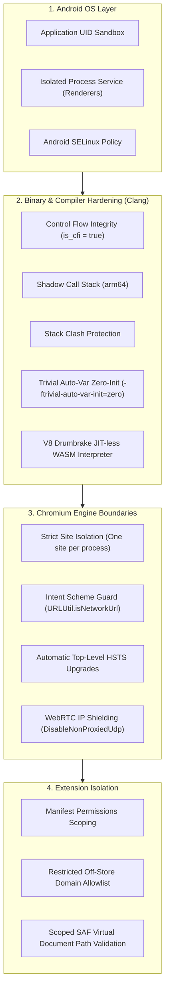

# 11 — Security Architecture, Sandboxing & Vulnerability Mitigations

## 1. Multi-Tier Security Model

Titanium Browser establishes security across four distinct layers:



---

## 2. Process Sandboxing & Isolation

### 1. Android Isolated Processes
- Chromium renderers and network services execute within Android `isolatedProcess="true"` services.
- Isolated processes have a distinct, ephemeral UID with zero Android framework permissions, preventing direct access to the filesystem, camera, microphone, or network interfaces without browser broker mediation.

### 2. Strict Site Isolation
- Inherited from Vanadium (`0123-enable-strict-site-isolation-by-default-on-Android.patch`).
- Forces every web origin into a dedicated OS renderer process.
- Mitigates speculative execution hardware side-channel vulnerabilities (Spectre / Meltdown) by ensuring sensitive authentication cookies and cross-origin data are never mapped into the same memory space as third-party iframes.

---

## 3. Native Compiler Hardening

Vanadium injects advanced compiler flags into Chromium's Clang toolchain configuration:

| Hardening Flag | Patch Reference | Vulnerability Class Mitigated |
| :--- | :--- | :--- |
| **Shadow Call Stack** | `Vanadium:0015-0016` | Return-Oriented Programming (ROP) attacks on ARM64 by storing return addresses on a dedicated, isolated shadow stack. |
| **Stack Clash Protection** | `Vanadium:0010` | Stack overflow clashes with memory heap/mmap regions (`-fstack-clash-protection`). |
| **Auto-Variable Zero Initialization** | `Vanadium:0013` | Uninitialized memory reads / information disclosure vulnerabilities (`-ftrivial-auto-var-init=zero`). |
| **Stack Protector Strong** | `Vanadium:0011` | Stack buffer overflows (`-fstack-protector-strong`). |
| **V8 Drumbrake Interpreter** | [`args.gn:L36-37`](file:///v:/android-Zyro-browser-main/android-zyro-browser-main/args.gn#L36-L37) | WebAssembly JIT vulnerabilities by running WASM bytecode through a bounds-checked interpreter instead of generating executable machine code in memory. |

---

## 4. Intent Security & Scheme Guarding

One of the most frequent attack vectors in mobile browsers is **malicious intent injection** from untrusted third-party apps installed on the device.

### Vulnerability Vector
An attacker app sends an explicit intent to the browser:
```java
Intent intent = new Intent(Intent.ACTION_VIEW, Uri.parse("content://victim.app/private_data"));
startActivity(intent);
```
Or attempts to execute script in browser context:
```java
Intent intent = new Intent(Intent.ACTION_VIEW, Uri.parse("javascript:alert(document.cookie)"));
startActivity(intent);
```

### Titanium Scheme Guard Defense
In [`patch.sh`](file:///v:/android-Zyro-browser-main/android-zyro-browser-main/patch.sh#L22-L24), Titanium patches `LaunchIntentDispatcherHooks.java` to enforce `android.webkit.URLUtil.isNetworkUrl`:
- Any URL that does not begin with `http://` or `https://` is immediately dropped or sanitized.
- Custom Tab intents with non-network schemes are immediately returned unhandled.
- External intents attempting to load `file://`, `content://`, `javascript:`, or raw `intent:` URIs are neutralized at the Android OS boundary.

---

## 5. Cryptographic Storage & Secrets Audit

### 1. Sensitive Data at Rest (OSCrypt)
- Saved passwords and cookie encryption keys are encrypted via Chromium’s `OSCrypt` interface.
- On Android, `OSCrypt` utilizes AES-256-GCM encryption with keys derived from the hardware-backed **Android Keystore System**.

### 2. Repository Secrets & Key Management Audit
- **Audit Finding**: **NO private signing keys or credentials are hardcoded or checked into this repository.**
- Signing keys and keystore passwords are consumed dynamically from GitHub Actions environment secrets (`${{ secrets.LOCAL_TEST_JKS }}` and `${{ secrets.STORE_TEST_JKS }}`).
- In [`common.sh`](file:///v:/android-Zyro-browser-main/android-zyro-browser-main/common.sh#L12-L13), `LOCAL_TEST_JKS` and `STORE_TEST_JKS` are immediately wiped from shell memory after writing temporary files, and [`build.sh`](file:///v:/android-Zyro-browser-main/android-zyro-browser-main/build.sh#L53) removes the temporary `keys/` directory after signing completes.
- In [`args.gn`](file:///v:/android-Zyro-browser-main/android-zyro-browser-main/args.gn#L18-L20), Google API keys are deliberately stubbed with dummy values (`google_api_key = "x"`), preventing unauthorized token usage.
