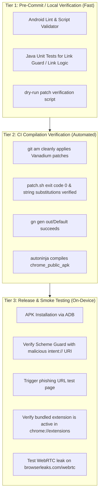

# 13 — Testing Architecture & Quality Verification Strategy

## 1. Current State of Repository Testing

An analysis of this repository reveals:
1. **Zero Local Test Files**: There are no unit test suites (JUnit, Robolectric, or Espresso) checked directly into `android-titanium-browser`.
2. **CI Pipeline Omits Test Execution**: [`.github/workflows/build.yml`](file:///v:/android-Zyro-browser-main/android-zyro-browser-main/.github/workflows/build.yml) does **not** execute automated unit tests or emulator instrumentation suites. The CI pipeline functions strictly as a **compilation, packaging, signing, and attestation pipeline**.
3. **Implicit Upstream Verification**: Titanium relies on Google's comprehensive upstream Chromium test suite (thousands of unit and browser tests executed upstream before tags are cut) and GrapheneOS Vanadium's testing.
4. **Compile-Time Static Validation**:
   - `gn gen` enforces build graph consistency and flag compatibility.
   - `git am` and `patch.sh` serve as canary checks: if upstream changes break any patch assumption, the build fails immediately.
   - Google Clang enforces strict type checking, Control Flow Integrity (CFI), and compile-time warnings.

---

## 2. Testing Targets Available in Chromium Tree

When the full Chromium tree is checked out during build, extensive test suites become available if explicitly built:

| Test Target | Technology | Purpose | Execution Feasibility in CI |
| :--- | :--- | :--- | :--- |
| **`chrome_public_test_apk`** | Android Instrumentation / Espresso | Runs on-device tests for Android UI, tab switcher, omnibox, and settings. | **High Cost**: Requires Android emulator or physical device runner; takes ~45 minutes to execute. |
| **`unit_tests`** | C++ GTest | Tests Chromium core algorithms, URL parsing, and network logic. | **Medium Cost**: Can run headless on Linux host without an Android device. |
| **`content_unittests`** | C++ GTest | Validates navigation, frame management, and web security invariants. | **Medium Cost**: Headless execution on Linux host. |
| **`chrome_java_test_support`** | JUnit 4 / Android Robolectric | Java unit tests for Chromium Android controllers and utilities. | **Low Cost**: Runs on JVM without launching an emulator. |

---

## 3. Recommended Testing Strategy for True Links

When introducing True Links features (e.g. Link Guard, Custom Ad Engine, Remote Config, Firebase telemetry), relying solely on manual APK testing is risky. We recommend a **tiered verification strategy**:



### Key Canary Tests for True Links Changes
1. **Intent Interception Test**: Send an `intent://` or `file:///android_asset/` URI via ADB:
   ```bash
   adb shell am start -a android.intent.action.VIEW -d "intent://example.com#Intent;scheme=http;package=com.truelinks.browser;end"
   ```
   *Expected Result*: Browser rejects or sanitizes URL without crash or arbitrary app execution.
2. **Link Guard Trigger Test**: Navigate to a known test domain (`http://malware-test.truelinks.org`):
   *Expected Result*: Link Guard interception modal appears; page navigation is deferred until user approves.
3. **Extension Load Test**: Inspect `chrome://extensions`:
   *Expected Result*: True Links companion extension is staged and active.
