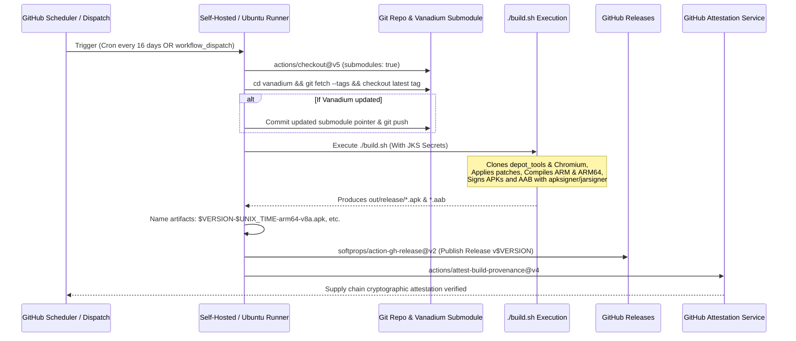

# 14 — CI/CD, Release Automation & Supply Chain Security

## 1. CI/CD Architecture Overview

Continuous Integration and Release Automation are handled entirely via GitHub Actions in [`.github/workflows/build.yml`](file:///v:/android-Zyro-browser-main/android-zyro-browser-main/.github/workflows/build.yml).



---

## 2. Trigger Configuration & Environment Requirements

### Triggers
- **`workflow_dispatch`**: Manual build execution from GitHub UI. Supports selecting runner type (`self-hosted` or `ubuntu-latest`).
- **`schedule`**: Recurring cron: `0 0 */16 * *` (Executes automatically every 16 days to track upstream Chromium and Vanadium patch releases).

### Runner Compute Requirements
> [!WARNING]
> **Compiling Chromium requires massive computing resources.**
> - **Disk Space**: At least **120 GB** of free SSD storage (Chromium checkout is ~50GB, compilation intermediate objects are ~50GB).
> - **RAM**: Minimum **32 GB RAM** (64 GB strongly recommended) or Clang LTO links will trigger Linux OOM Killer.
> - **CPU**: 16+ cores recommended.
> Standard free `ubuntu-latest` GitHub-hosted runners have limited CPU and 14GB RAM, which will exhaust memory or exceed the 6-hour job timeout. Therefore, `build.yml` specifies `self-hosted` as the default runner.

---

## 3. Detailed Workflow Steps Analysis

### Step 1: Submodule Upstream Tracking
```yaml
- name: Update 
  run: |
    cd vanadium
    git fetch --tags
    git checkout $(git tag | sort -V | tail -n1)
    cd ..
    git add vanadium
    if ! git diff --staged --quiet; then
      git commit -am "update"
      git push
    fi
```
Automatically tracks GrapheneOS Vanadium releases. If a new version tag exists, it checks it out, commits the updated submodule SHA back into the main repository, and pushes to GitHub.

### Step 2: Build Execution
```yaml
- name: Build
  env:
    DEBIAN_FRONTEND: noninteractive
    LOCAL_TEST_JKS: ${{ secrets.LOCAL_TEST_JKS }}
    STORE_TEST_JKS: ${{ secrets.STORE_TEST_JKS }}
  run: |
    ./build.sh
```
Executes the master build script described in `03-build-system.md`. Passes base64 encoded keystore files through secure environment variables.

### Step 3: Artifact Renaming & Release Publishing
```yaml
- name: Publish
  uses: softprops/action-gh-release@v2
  with:
    token: ${{ secrets.GITHUB_TOKEN }}
    name: v${{ env.VERSION }}
    tag_name: v${{ env.VERSION }}
    files: |
      ${{ env.VERSION }}-${{ env.unix_time }}-arm64-v8a.aab
      ${{ env.VERSION }}-${{ env.unix_time }}-arm64-v8a.apk
      ${{ env.VERSION }}-${{ env.unix_time }}-armeabi-v7a.apk
```
Publishes:
1. `*-armeabi-v7a.apk`: 32-bit ARM APK for older Android devices.
2. `*-arm64-v8a.apk`: 64-bit ARM APK for modern smartphones (sideloading / direct install).
3. `*-arm64-v8a.aab`: Android App Bundle for Google Play Store publishing.

### Step 4: Supply Chain Attestation (SLSA Provenance)
```yaml
- name: Attest
  uses: actions/attest-build-provenance@v4
  with:
    subject-path: |
      ${{ env.VERSION }}-${{ env.unix_time }}-arm64-v8a.aab
      ${{ env.VERSION }}-${{ env.unix_time }}-arm64-v8a.apk
      ${{ env.VERSION }}-${{ env.unix_time }}-armeabi-v7a.apk
```
Generates cryptographically signed build provenance using GitHub's OIDC token. Users can verify the authentic origin of any binary using the GitHub CLI:
```bash
gh attestation verify *.apk -R jqssun/android-titanium-browser
```
