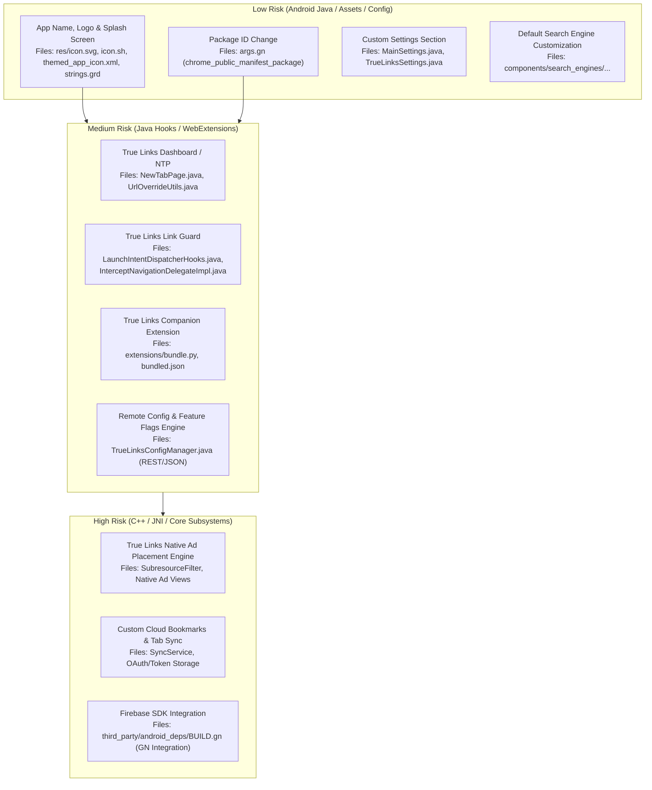

# 16 — True Links Transformation Roadmap & Change Impact Map

> [!NOTE]
> **This document is an architectural impact analysis only. No production changes are implemented in this phase.**

---

## 1. Risk Tier Classification

| Risk Level | Definition | Impact on Build & Stability |
| :--- | :--- | :--- |
| **LOW RISK** | Isolated branding, visual assets, simple string replacements, or standalone Android Java preferences. | Does not affect Chromium native C++ or JNI. Zero chance of engine compilation failure. |
| **MEDIUM RISK** | Changes to Android Java navigation delegates, intent hooks, or bundling custom WebExtensions. | Affects Java browser behavior; easily debuggable with Android logcat. Does not break C++ compilation. |
| **HIGH RISK** | Modifying Chromium C++ classes, JNI bridges, subresource filter logic, or introducing new native libraries. | High compilation cost; risk of native memory leaks, race conditions, or SIGSEGV crashes. |
| **VERY HIGH RISK** | Upgrading upstream Chromium milestone, altering core Blink/V8 memory allocators, or attempting to force standard Gradle build pipelines onto Chromium's GN engine. | Extreme breakage potential; can invalidate entire patch sets and take weeks to stabilize. |

---

## 2. Comprehensive Feature Change Impact Map



---

## 3. Detailed Component Analysis

### 1. App Name, Logo & Branding (LOW RISK)
- **Goal**: Rebrand Titanium Browser to **True Links Browser**.
- **Files to Modify**:
  - [`res/icon.svg`](file:///v:/android-Zyro-browser-main/android-zyro-browser-main/res/icon.svg): Replace with True Links master vector artwork.
  - [`res/icon.sh`](file:///v:/android-Zyro-browser-main/android-zyro-browser-main/res/icon.sh): Update design scale and sample color palette points for True Links brand colors.
  - [`res/drawable/themed_app_icon.xml`](file:///v:/android-Zyro-browser-main/android-zyro-browser-main/res/drawable/themed_app_icon.xml): Update monochrome vector path.
  - [`build.sh`](file:///v:/android-Zyro-browser-main/android-zyro-browser-main/build.sh#L27-L29): Add string replacement:
    ```bash
    replace "$SCRIPT_DIR/vanadium/patches" "TITANIUM" "TRUELINKS"
    replace "$SCRIPT_DIR/vanadium/patches" "Titanium" "True Links"
    replace "$SCRIPT_DIR/vanadium/patches" "titanium" "truelinks"
    ```
  - `chrome/browser/ui/android/strings/android_chrome_strings.grd`: Update `<message name="IDS_APP_NAME">True Links</message>`.

### 2. Application ID & Package Renaming (LOW RISK)
- **Goal**: Change package from `io.github.jqssun.helium` to `com.truelinks.browser`.
- **Files to Modify**:
  - [`args.gn`](file:///v:/android-Zyro-browser-main/android-zyro-browser-main/args.gn#L1):
    ```gn
    chrome_public_manifest_package = "com.truelinks.browser"
    ```
  - [`common.sh`](file:///v:/android-Zyro-browser-main/android-zyro-browser-main/common.sh): Update keystore alias and properties.

### 3. True Links Link Guard (MEDIUM RISK)
- **Goal**: Intercept hyperlinks before navigation, query threat intelligence / link reputation, verify tracking redirects, and present safety verification UI to the user.
- **Implementation Strategy**:
  1. **External Intents**: Intercept in `LaunchIntentDispatcherHooks.java`. If the URL is suspicious, launch `TrueLinksGuardActivity` modal.
  2. **In-Page Hyperlinks**: Hook `InterceptNavigationDelegateImpl.java` (`shouldIgnoreNavigation`). If the destination link requires verification:
     - Pause/cancel navigation handle.
     - Display a native True Links bottom sheet dialog (`TrueLinksGuardBottomSheet.java`).
     - If user confirms, resume navigation via `Tab.loadUrl()`.
- **Architectural Benefit**: Fully contained in Android Java; does **not** touch C++ engine files or trigger complex native re-compilations.

### 4. True Links Dashboard & New Tab Page (MEDIUM RISK)
- **Goal**: Custom True Links Home Screen with verified link bookmarks, safety score widget, and customizable news/search cards.
- **Files to Modify**:
  - `chrome/android/java/src/org/chromium/chrome/browser/ntp/NewTabPage.java`
  - `chrome/android/java/src/org/chromium/chrome/browser/ntp/NewTabPageLayout.java`
  - Or supply a local WebExtension that declares `"chrome_url_overrides": { "newtab": "dashboard.html" }`, which is already supported via Titanium's `UrlOverrideUtils.isNtpOverrideEnabled()` patch!

### 5. Remote Config & Feature Flags (MEDIUM RISK)
- **Goal**: Dynamically toggle Link Guard sensitivity, update blocklists, or rollout experimental features without releasing a new APK.
- **Implementation Strategy**:
  - Avoid heavy Google Firebase dependencies initially.
  - Implement a lightweight Java service (`TrueLinksConfigManager.java`) using Android `HttpURLConnection` to fetch a signed JSON config from the True Links backend on startup.
  - Cache config in `SharedPreferences`.

### 6. Firebase Analytics / Crashlytics Integration (HIGH RISK)
- **Goal**: Crash reporting and privacy-conscious product analytics.
- **Architectural Challenge**:
  - Standard Android apps add `implementation 'com.google.firebase:firebase-analytics'` to `build.gradle`.
  - **Chromium does not use Gradle in production!** All third-party Java libraries must be registered in `third_party/android_deps/build.gradle` and compiled into GN targets (`third_party/android_deps:google_play_services_basement_java`, etc.).
- **Recommendation**:
  - Evaluate whether Firebase is strictly necessary.
  - A lightweight, open-source alternative (e.g. Sentry Java SDK or a custom lightweight crash handler writing to `Thread.setDefaultUncaughtExceptionHandler`) can be integrated into `ChromeApplicationImpl.java` in a fraction of the time with near-zero build system risk.

### 7. Custom Ad Engine & Sponsored Placements (HIGH RISK)
- **Goal**: Show non-intrusive, privacy-respecting sponsored partner cards or search suggestions.
- **Files to Modify**:
  - **Option A (Native UI Overlay)**: Implement in `NewTabPageLayout.java` as a native Android card view (Safest).
  - **Option B (Engine Subresource Injector)**: Intercept HTML parsing in Blink (Extremely dangerous, very high risk).
  - **Option C (Companion Extension)**: Inject sponsored tiles via the pre-bundled True Links WebExtension (Safe, flexible, and remotely updatable).
